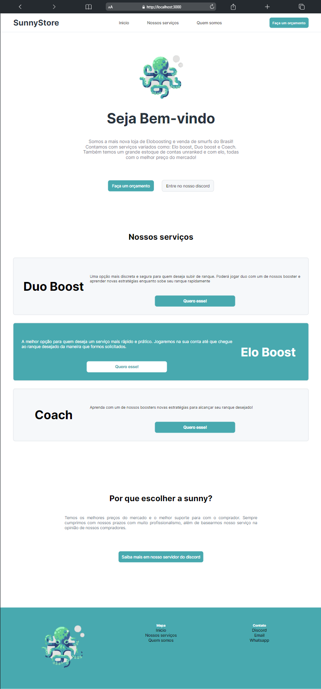
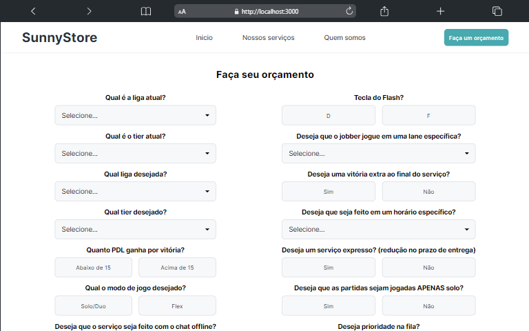
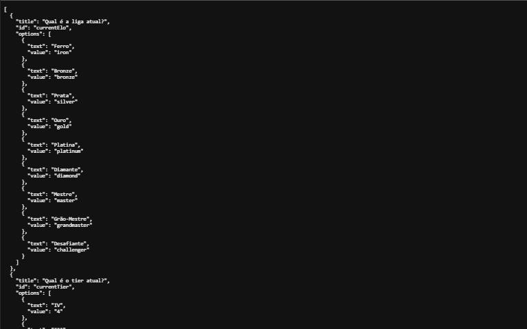

# Sunny WebSite

## Routes

### GET `/`

### GET `/calculo`

### GET `/api/questions`

## Installation ⚙️

1. Clone o repositório para o seu ambiente local.
2. Navegue até o diretório do projeto.
3. Execute o comando `npm install` para instalar as dependências.

## Usage 🚀

1. Execute o comando `npm run dev` para iniciar o servidor.
2. Acesse o endereço `http://localhost:3000` no seu navegador.

## Contribution 🤝

Contribuições são bem-vindas! Se você tiver sugestões, correções de bugs ou melhorias para o projeto, sinta-se à vontade para abrir uma solicitação de pull.

## License 📄

Este projeto está licenciado sob a [MIT License](./LICENSE.md).
